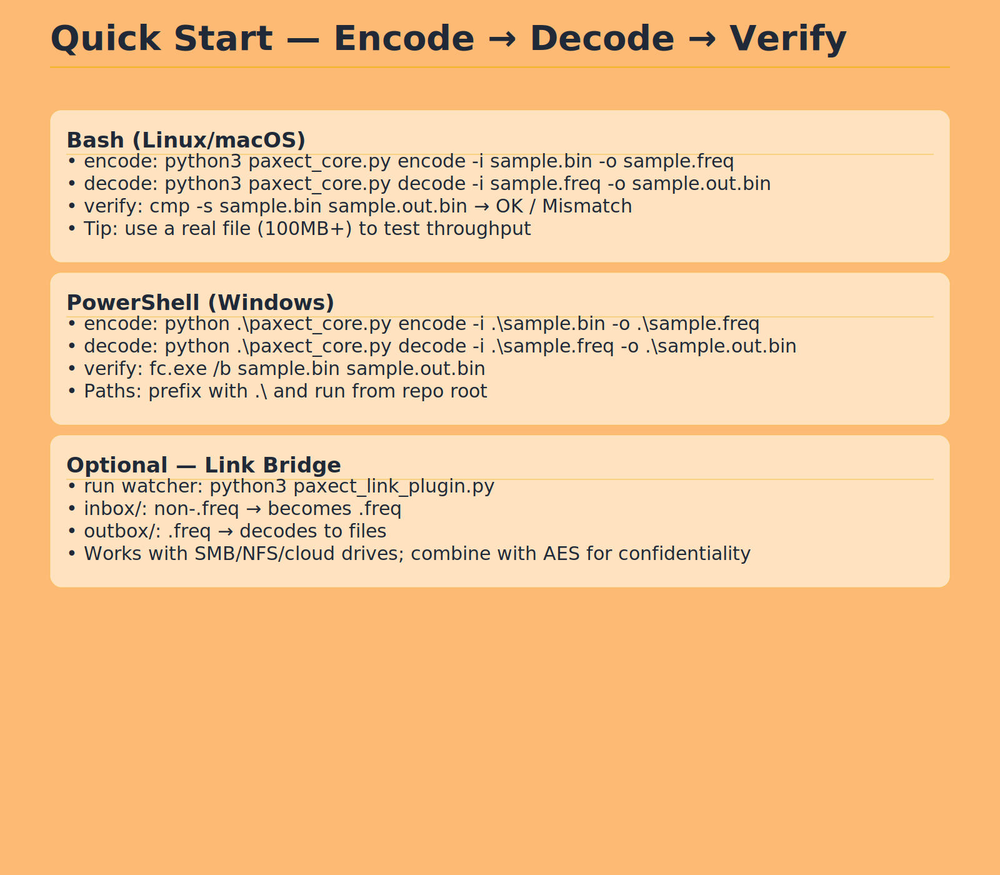
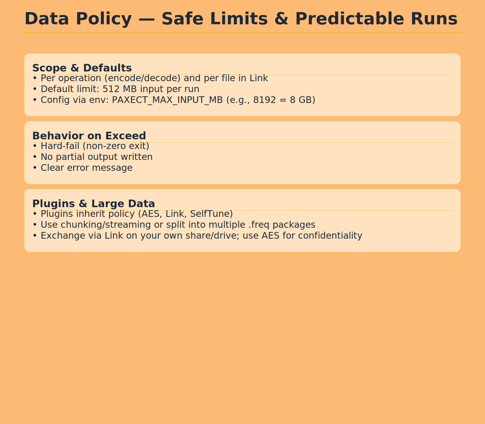

.svg)
.svg)
---Use Cases

    Quantum computing: Transfer simulation results between quantum and classical nodes
    AI/ML pipelines: Rapid and secure exchange of tensors, arrays, and models
    Embedded & IoT: Efficient for low-memory devices and robotics
    Big Data / HPC: Fast checkpointing and large-scale data migration
    Hybrid Systems: Seamless communication across heterogeneous architectures

.svg)

---

---

## Plugins (officieel)
| Plugin              | Scope                          | Highlights                                               | Repo |
|---------------------|--------------------------------|----------------------------------------------------------|------|
| **AES Secure**      | Vertrouwelijkheid & integriteit| AES-256 GCM/CTR, scrypt KDF, AAD, strikt falen           | https://github.com/PAXECT-Interface/paxect-aes-plugin |
| **Polyglot**        | Taal-bindings                  | Python, Node.js, Go; extra talen via enterprise          | https://github.com/PAXECT-Interface/paxect-polyglot-plugin |
| **SelfTune 5-in-1** | Performance & observability    | Guard, overhead-controle, logging, smoothing, auto-learning | https://github.com/PAXECT-Interface/paxect-selftune-5in1 |

**Plug-and-play:** Core draait zonder plugins; per run inschakelen via config/flag of binding-API. Determinisme blijft gelijk.
.svg)
.svg)

---

---

## Contact
**contact@paxect.io** · Issues: https://github.com/PAXECT-Interface/PAXECT---Core/issues · Discussions: https://github.com/PAXECT-Interface/PAXECT---Core/discussions

