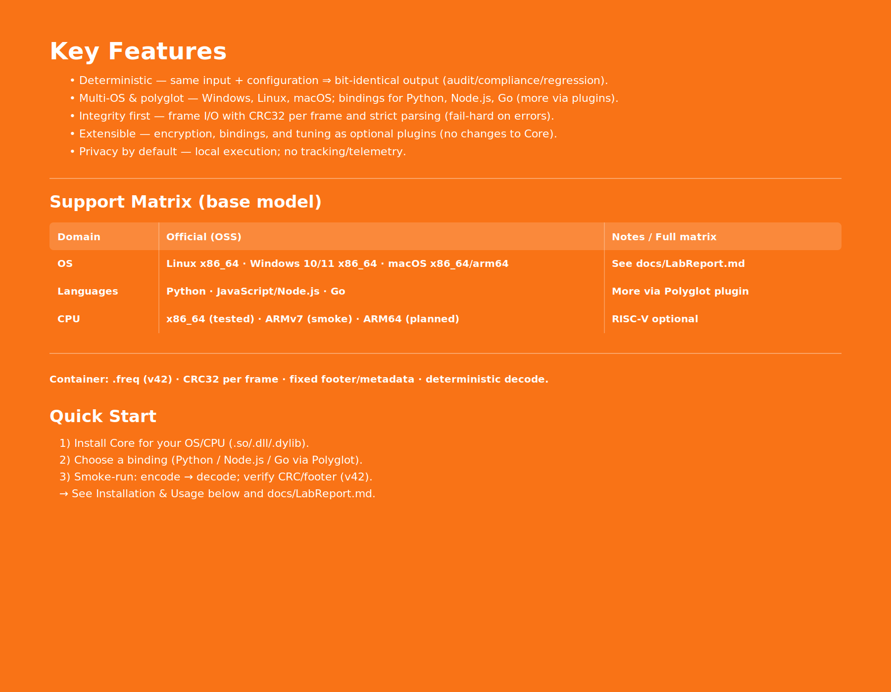

---Use Cases

    Quantum computing: Transfer simulation results between quantum and classical nodes
    AI/ML pipelines: Rapid and secure exchange of tensors, arrays, and models
    Embedded & IoT: Efficient for low-memory devices and robotics
    Big Data / HPC: Fast checkpointing and large-scale data migration
    Hybrid Systems: Seamless communication across heterogeneous architectures

---

## Support Matrix (base model)
| Domain        | Official (OSS)                                         | Notes / Full matrix         |
|---------------|--------------------------------------------------------|-----------------------------|
| **OS**        | Linux x86_64 · Windows 10/11 x86_64 · macOS x86_64/arm64 | See `docs/LabReport.md`     |
| **Languages** | Python · JavaScript/Node.js · Go                       | More via Polyglot plugin    |
| **CPU**       | x86_64 (tested) · ARMv7 (smoke) · ARM64 (planned)      | RISC-V optional             |

**Container:** `.freq` (v42) · CRC32 per frame · fixed footer/metadata · deterministic decode.

---

## Quick Start
1. **Install Core** for your OS/CPU (`.so/.dll/.dylib`).  
2. **Choose a binding** (Python / Node.js / Go via Polyglot).  
3. **Smoke-run:** encode → decode; verify CRC/footer (v42).  
   → See **Installation & Usage** below and `docs/LabReport.md`.

---

## Plugins (officieel)
| Plugin              | Scope                          | Highlights                                               | Repo |
|---------------------|--------------------------------|----------------------------------------------------------|------|
| **AES Secure**      | Vertrouwelijkheid & integriteit| AES-256 GCM/CTR, scrypt KDF, AAD, strikt falen           | https://github.com/PAXECT-Interface/paxect-aes-plugin |
| **Polyglot**        | Taal-bindings                  | Python, Node.js, Go; extra talen via enterprise          | https://github.com/PAXECT-Interface/paxect-polyglot-plugin |
| **SelfTune 5-in-1** | Performance & observability    | Guard, overhead-controle, logging, smoothing, auto-learning | https://github.com/PAXECT-Interface/paxect-selftune-5in1 |

**Plug-and-play:** Core draait zonder plugins; per run inschakelen via config/flag of binding-API. Determinisme blijft gelijk.

<!-- PAXECT — Key Features (orange block) -->

  

---

## Installatie & Gebruik (Quickstart)
- **Vereisten:** Linux/Windows/macOS; x86_64; voldoende schijfruimte voor input + tijdelijke frames.  
- **Encode (→ `.freq`):** framen → (optioneel) delta/mapping → compressie (zstd/LZ4/zlib) → CRC per frame → footer (v42).  
- **Decode (van `.freq`):** footer parsen → CRC valideren → (optioneel) decrypt → decompresseren → bytes reconstrueren.  
- **Streaming:** stdin/stdout met begrensd geheugen; onderbrekingen worden gedetecteerd.  
- **Foutgedrag:** CRC-mismatch / truncatie / ongeldige metadata ⇒ hard fail (geen gedeeltelijke output).

---

## Roadmap (hoogover)
- **v0.9.0:** deterministische Core; zstd/LZ4/zlib; LabReport; basis-CI (determinisme/streaming/corruptie).  
- **v1.0.0:** bredere OS-matrix (Windows CMD, macOS soak), eerste ARM64 build; AES-release; Polyglot stable; SelfTune public.  
- **Na 1.0:** prebuilt binaries, SBOM/attestations, extra bindings/integraties (Kafka/S3/SIEM), LTS.

---

## Governance, Security & Privacy
- **Licentie:** Apache-2.0 (`LICENSE`, `NOTICE`) · **Merken:** zie `TRADEMARKS.md`.  
- **Bijdragen & Gedragscode:** `CONTRIBUTING.md`, `CODE_OF_CONDUCT.md`. **Security:** `SECURITY.md`.  
- **Privacy:** geen telemetry of externe uploads; lokaal by default. Zie `docs/PRIVACY.md`.

**Vragen of verzoeken? Mail ons of open een GitHub issue!**

---

## Contact
**contact@paxect.io** · Issues: https://github.com/PAXECT-Interface/PAXECT---Core/issues · Discussions: https://github.com/PAXECT-Interface/PAXECT---Core/discussions

