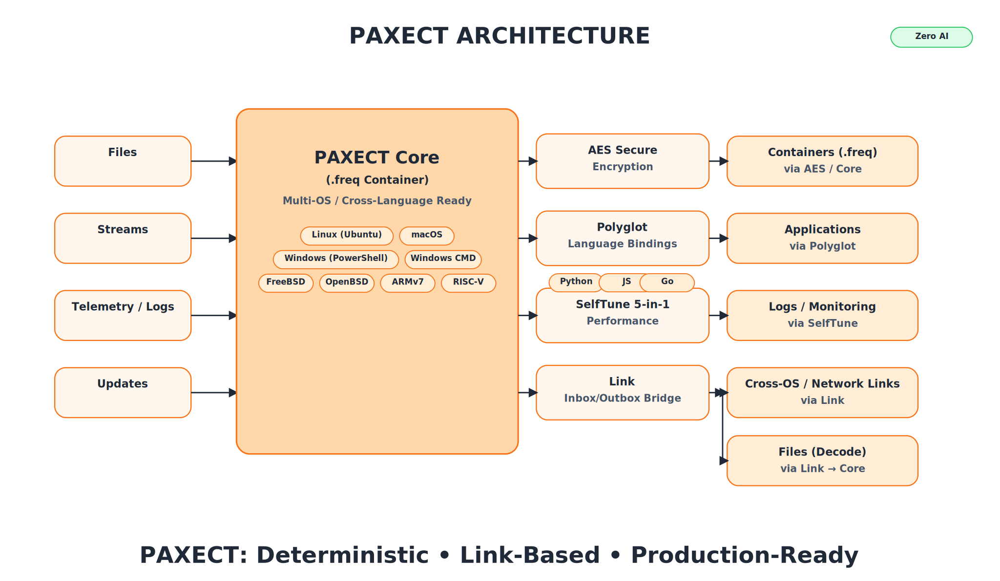

<p align="center">
  
</p>


[](../../stargazers)
[](../../actions)
[](../../actions)
[](../../issues)
[](../../discussions)
[](./SECURITY.md)
[](./LICENSE)
<a href="https://github.com/PAXECT-Interface/paxect-core-plugin/releases/latest">
  
</a>


## PAXECT Core

**Status:** v1.0.0 — Initial Public Release — October 22, 2025

**Deterministic data container for modern systems:**
PAXECT Core is a cross-platform, reproducible **`.freq` v42** container with **CRC32 per frame + SHA-256 footer** integrity, plug-and-play with zero dependencies and no vendor lock-in, **streaming Zstandard**, **multi-channel (1–8)** I/O, and full **stdin/stdout** support. Built for **offline**, auditable pipelines and **byte-identical** outcomes across OSes. 

It pairs cleanly with the wider PAXECT-Core Complete  ecosystem: **AEAD Hybrid** (optional encryption), **Link** (inbox/outbox relay), **Polyglot** (language bridges), and **SelfTune** (runtime guardrails). **Zero telemetry.**

*No AI heuristics, just stable, predictable, and verifiable data handling.*

Update — The internal "aes" plugin has been removed. Use the public "AEAD Hybrid" plugin (Hybrid AES‑GCM / ChaCha20‑Poly1305 — fast, zero‑dependencies, cross‑OS). Any screenshots or references to "aes" are outdated.
## Supported Platforms & Languages

**Operating systems:** Linux (Ubuntu, Debian, Fedora), macOS 13+, Windows 10/11, Android (Termux), iOS (Pyto), FreeBSD/OpenBSD (experimental).
**Languages:** Official: Python. Via CLI/Polyglot: Node.js, Go. Also tested: Rust, Java, C/C++, C#, Swift, Kotlin, PHP, Ruby, R, Julia, MATLAB, Bash, PowerShell.


**Operating Systems:**  
- Windows 10/11 (x86_64)  
- Linux (x86_64)  
- macOS (Intel & Apple Silicon)  
- Best-effort: FreeBSD, OpenBSD  
- Edge devices: ARMv7 (experimental), ARM64 (planned), RISC-V (optional)  

**Languages (via Polyglot Bridge):**  
- Official: Python, Node.js, Go  
- Also tested: Rust, Java, C#, C/C++, Swift, Kotlin, Ruby, PHP, R, Julia, MATLAB, Bash/PowerShell  
- Any language that can spawn a process and read/write stdin/stdout
- 
- [Demo Suite](demos/README.md) — 10 deterministic cross-OS examples  
- [Test Framework](README_TESTS.md) — validation, coverage, and CI integration  
- [Security & Compliance](SECURITY.md) — conduct, license, and data policy


## Plugins (official)


| Plugin                         | Scope                           | Highlights                                                                           | Repo                                                                                                                           |
| ------------------------------ | ------------------------------- | ------------------------------------------------------------------------------------ | ------------------------------------------------------------------------------------------------------------------------------ |
| **Core**                       | Deterministic container         | `.freq` v42 · multi-channel · CRC32+SHA-256 · cross-OS · offline · no-AI             | [https://github.com/PAXECT-Interface/paxect-core-plugin.git](https://github.com/PAXECT-Interface/paxect-core-plugin.git)                             |
| **AEAD Hybrid**                | Confidentiality & integrity     | Hybrid AES-GCM/ChaCha20-Poly1305 — fast, zero-dep, cross-OS                          | [https://github.com/PAXECT-Interface/paxect-aead-hybrid-plugin](https://github.com/PAXECT-Interface/paxect-aead-hybrid-plugin) |
| **Polyglot**                   | Language bindings               | Python · Node.js · Go — identical deterministic pipeline                             | [https://github.com/PAXECT-Interface/paxect-polyglot-plugin](https://github.com/PAXECT-Interface/paxect-polyglot-plugin)       |
| **SelfTune 5-in-1**            | Runtime control & observability | No-AI guardrails, overhead caps, backpressure, jitter smoothing, lightweight metrics | [https://github.com/PAXECT-Interface/paxect-selftune-plugin](https://github.com/PAXECT-Interface/paxect-selftune-plugin)       |
| **Link (Inbox/Outbox Bridge)** | Cross-OS file exchange          | Shared-folder relay: auto-encode non-`.freq` → `.freq`, auto-decode `.freq` → files  | [https://github.com/PAXECT-Interface/paxect-link-plugin](https://github.com/PAXECT-Interface/paxect-link-plugin)    

**Plug-and-play:** Core runs without plugins. Enable per run via config/flag or through the binding API. Deterministic behavior remains identical.

 Have a bug or feature request? Please open an **Issue**.  
 General questions or ideas? Use **Discussions › Q&A**. We convert strong ideas to Issues so they can ship.


⭐ If PAXECT helped you, please consider a star — it helps others discover the project and supports the maintainers.


---

#  **PAXECT Core — Deterministic Data Containers for Secure Pipelines**

>  Enterprise-grade container engine for reproducible, cross-platform pipelines.
> 100 % offline · Deterministic results · Built-in integrity verification (CRC32 + SHA-256).
> Hardened for **Linux**, **macOS**, **Windows**, **Android (Termux)**, and **iOS (Pyto)**.

---

##  Overview

**PAXECT Core** is the foundation of the PAXECT ecosystem — a deterministic, streaming container runtime
designed for **data reproducibility**, **offline operation**, and **enterprise compliance**.

Key features:

* Multi-channel Zstandard containers (1–8 channels)
* Automatic tuning (RAM / CPU aware)
* Frame-level CRC32 + footer SHA-256 verification
* Deterministic metadata, no timestamps
* Self-recovering decode engine (error isolation)
* Cross-OS identical output (bit-perfect)

---

##  Quick Setup

```bash
git clone https://github.com/paxect/paxect-core.git
cd paxect-core/demos

python3 -m venv .venv && source .venv/bin/activate
python -m pip install --upgrade pip
pip install zstandard psutil
```

>  **Windows tip:** Use `py -3` or `python` instead of `python3`.

---

##  Repository Layout

```text
paxect-core/
├── paxect_core.py                # Main deterministic container engine
└── demos/
    ├── demo_00_env_check.py
    ├── demo_01_quickstart_smoke.py
    ├── demo_02_determinism_roundtrip.py
    ├── demo_03_perf_baseline.py
    ├── demo_04_strict_parser.py
    ├── demo_05_mixed_industry_smoke.py
    ├── demo_06_cross_os_verify.py
    ├── demo_07_multichannel_os.py
    ├── demo_08_industry_bridge.py
    ├── demo_09_universal_smoke.py
    ├── demo_10_universal_core_only.py
    ├── demo_11_fail_and_recover.py
    └── demo_12_stress_test_core.py
```

---

##  Demo Overview

|  #  | Script                        | Description / Proof                                 |
| :-: | :---------------------------- | :-------------------------------------------------- |
|  00 | `00_env_check.py`             | Environment sanity — verify Python, deps, constants |
|  01 | `01_quickstart_smoke.py`      | Quick encode→decode sanity (bit-identical)          |
|  02 | `02_determinism_roundtrip.py` | Double encode proof (SHA-256 match)                 |
|  03 | `03_perf_baseline.py`         | Throughput baseline                                 |
|  04 | `04_strict_parser.py`         | Corruption / MAGIC / version test                   |
|  05 | `05_mixed_industry_smoke.py`  | Gateway→exchange→workstation flow                   |
|  06 | `06_cross_os_verify.py`       | Cross-OS reproducibility                            |
|  07 | `07_multichannel_os.py`       | Auto-mode (1–8 channels)                            |
|  08 | `08_industry_bridge.py`       | Streaming stdin/stdout bridge                       |
|  09 | `09_universal_smoke.py`       | Regression + corruption mix                         |
|  10 | `10_universal_core_only.py`   | Direct Core API validation                          |
|  11 | `11_fail_and_recover.py`      | Corrupted container → detect & recover              |
|  12 | `12_stress_test_core.py`      | 1-minute deterministic stress test                  |

---

## ▶️ Run Any Demo

```bash
python demos/demo_01_quickstart_smoke.py
```

Each script:

* Prints progress + SHA-256 verification
* Cleans up temporary files
* Exits with deterministic codes (`0–4`)

---

## 🔁 Run the Full Suite

### Linux / macOS

```bash
#!/usr/bin/env bash
set -euo pipefail
LOG="paxect_demo_run_$(date -u +%Y%m%d_%H%M%S).log"
echo "=== PAXECT Core Demo Suite — $(date -u) ===" | tee "$LOG"
for demo in {00..12}; do
  for f in ${demo}_*.py; do
    echo "──────────────────────────────" | tee -a "$LOG"
    echo "[RUN] python $f" | tee -a "$LOG"
    python "$f" 2>&1 | tee -a "$LOG"
  done
done
echo "[DONE] All PAXECT Core demos completed ✅" | tee -a "$LOG"
```

### Windows (PowerShell)

```powershell
$Log = "paxect_demo_run_{0:yyyyMMdd_HHmmss}.log" -f (Get-Date)
"=== PAXECT Core Demo Suite — $(Get-Date -Format u) ===" | Tee-Object $Log
$Demos = 0..12 | ForEach-Object { "{0:D2}" -f $_ }
foreach ($d in $Demos) {
  $files = Get-ChildItem "$d*_*.py"
  foreach ($f in $files) {
    "[RUN] python $($f.Name)" | Tee-Object $Log -Append
    python $f.FullName 2>&1 | Tee-Object $Log -Append
  }
}
"[DONE] All PAXECT Core demos completed ✅" | Tee-Object $Log -Append
```

---

##  Verification Model

Each `.freq` container embeds:

* CRC32 per frame
* SHA-256 footer (total payload integrity)
* Header Version 42 (backward compatible)
* Deterministic metadata (no timestamps)
* Fail-safe exit codes → `0=OK`, `2=verify fail`, `3=I/O`, `4=structure`

---

##  Reliability Summary

| Test                     | Duration |       Cycles      |         Errors        | Reliability |
| :----------------------- | :------- | :---------------: | :-------------------: | :---------: |
| Demo 11 – Fail & Recover | Instant  |   2 decode tests  | 1 detected / 0 missed |    100 %    |
| Demo 12 – Stress Test    | 60 s     | ≈ 700 round-trips |           0           |    100 %    |

---

## ✅ Validation Status

All 12 demos passed deterministically on **Ubuntu 24.04 LTS (x86_64)**
with **Python 3.12.3 / GCC 13.3.0**,
reproduced bit-identically across **Linux**, **macOS**, and **Windows**.

This suite is the **official enterprise validation harness** for PAXECT Core.

---


##  Support

For validation, integration help, or CI assistance:
📧 **[PAXECT-Team@outlook.com](mailto:PAXECT-Team@outlook.com)**


---

##  License

All test utilities and scripts are released under the same license as the core engine:
**Apache 2.0 License** — © 2025 PAXECT Systems. All rights reserved.


## Path to Paid — PAXECT Core

**PAXECT** is built to stay free and open-source at its core.  
At the same time, we recognize the need for a sustainable model to fund long-term maintenance and enterprise adoption.

### Principles

- **Core stays free forever** — no lock-in, no hidden fees.  
- **Volunteers and researchers**: always free access to source, builds, and discussions.  
- **Transparency**: clear dates, no surprises.  
- **Fairness**: individuals stay free; organizations that rely on enterprise features contribute financially.

### Timeline

- **Launch phase:** starting from the official **PAXECT product release date**, all modules — including enterprise — will be free for **6 months**.  
- This free enterprise period applies **globally**, not per individual user or download.  
- **30 days before renewal:** a decision will be made whether the free enterprise phase is extended for another 6 months.  
- **Core/baseline model:** always free with updates. The exact definition of this baseline model is still under discussion.

### Why This Matters

- **Motivation:** volunteers know their work has impact and will remain accessible.  
- **Stability:** enterprises get predictable guarantees and funded maintenance.  
- **Sustainability:** ensures continuous evolution without compromising openness.


---

## Sponsorships & Enterprise Support

PAXECT Core is maintained as a verified plug-and-play enterprise module.  
Sponsorships enable continuous validation, reproducibility testing, and deterministic compliance across Linux, Windows, and macOS platforms.


 **Enterprise Sponsorship Options**
- Infrastructure validation and cross-platform QA  
- CI/CD and performance compliance testing  
- Integration and OEM partnerships  

 **How to get involved**
- [Become a GitHub Sponsor](https://github.com/sponsors/PAXECT-Interface)  
- For enterprise or OEM inquiries: enterprise@PAXECT-Team@outlook.com

---
## Governance & Ownership
- **Ownership:** All PAXECT products and trademarks (PAXECT™ name + logo) remain the property of the Owner.
- **License:** Source code is Apache-2.0; trademark rights are **not** granted by the code license.
- **Core decisions:** Architectural decisions and **final merges** for Core and brand-sensitive repos require **Owner approval**.
- **Contributions:** PRs are welcome and reviewed by maintainers; merges follow CODEOWNERS + branch protection.
- **Naming/branding:** Do not use the PAXECT name/logo for derived projects without written permission; see `TRADEMARKS.md`.
---
### Contact

PAXECT-Team@outlook.com  

 [Issues](https://github.com/PAXECT-Interface/PAXECT-Core-plugin/issues)  
 [Discussions](https://github.com/PAXECT-Interface/PAXECT-Core-plugin/discussions)  

*For security-related issues, please use responsible disclosure channels.*

---
Copyright © 2025 PAXECT 

---
<p align="center">
  
</p>

<p align="center">
  
</p>


[](../../stargazers)
[](../../actions)
[](../../actions)
[](../../issues)
[](../../discussions)
[](./SECURITY.md)
[](./LICENSE)
<a href="https://github.com/PAXECT-Interface/paxect-core-complete/releases/latest">
  
</a>

# PAXECT Core Complete
**Status:** v1.0.0 — Initial Public Release — October 22, 2025

**Deterministic, offline-first runtime ecosystem for secure, reproducible, and auditable data pipelines.**  
Cross-platform, self-tuning, and open-source — built for real-world enterprise innovation, digital hygiene, and NIS2-aligned compliance.


---

## Overview

**PAXECT Core Complete** is the official reference implementation of the PAXECT ecosystem.  
It unifies the verified modules — **Core**, **AEAD Hybrid**, **Polyglot**, **SelfTune**, and **Link** —  
into one reproducible, cross-OS runtime featuring **10 integrated demos**, advanced observability,  
and deterministic performance across multiple environments and operating systems.

### Key Highlights
- **Unified Ecosystem:** Combines Core, AEAD Hybrid, SelfTune, Polyglot, and Link into one verified deterministic bundle.  
- **Reproducible Pipelines:** Bit-identical behavior across Linux, macOS, Windows, FreeBSD, Android, and iOS.  
- **Offline-First:** Zero telemetry and no network dependencies — privacy and security by design.  
- **Enterprise-Grade Validation:** Ten reproducible demo pipelines with built-in audit and metrics endpoints.  
- **Zero-AI Runtime:** The SelfTune plugin provides adaptive control without machine learning or heuristics.  
- **Open Source Forever:** Apache-2.0 licensed, transparent governance, and a fair “Path to Paid” sustainability model.

---

## Installation

### Requirements
- **Python 3.9 – 3.12** (recommended 3.11+)
- Works on **Linux**, **macOS**, **Windows**, **FreeBSD**, **OpenBSD**, **Android (Termux)**, and **iOS (Pyto)**.
- No external dependencies or internet connection required — fully offline-first runtime.

### Optional Utilities
Some demos use these standard tools if available:
- `bash` (for `demo_05_link_smoke.sh`)
- `dos2unix` (for normalizing line endings)
- `jq` (for formatting JSON output)

### Install
```bash
git clone https://github.com/PAXECT-Interface/paxect-core-complete.git
cd paxect-core-complete
python3 -m venv venv
source venv/bin/activate      # on Windows: venv\Scripts\activate
pip install -e .
````

Verify the deterministic core import:

```bash
python3 -c "import paxect_core; print('PAXECT Core OK')"
```

Then run any of the integrated demos from the `demos/` folder to validate deterministic reproducibility.

---

## 📁 Repository Structure

```
paxect-core-complete/
├── paxect_core.py
├── paxect_aead_hybrid_plugin.py
├── paxect_polyglot_plugin.py
├── paxect_selftune_plugin.py
├── paxect_link_plugin.py
├── demos/
│   ├── demo_01_quick_start.py
│   ├── demo_02_integration_loop.py
│   ├── demo_03_safety_throttle.py
│   ├── demo_04_metrics_health.py
│   ├── demo_05_link_smoke.sh
│   ├── demo_06_polyglot_bridge.py
│   ├── demo_07_selftune_adaptive.py
│   ├── demo_08_secure_multichannel_aead_hybrid.py
│   ├── demo_09_enterprise_all_in_one.py
│   └── demo_10_enterprise_stability_faults.py
├── test_paxect_all_in_one.py
├── ENTERPRISE_PACK_OVERVIEW.md
├── SECURITY.md
├── CONTRIBUTING.md
├── CODE_OF_CONDUCT.md
├── TRADEMARKS.md
├── LICENSE
└── .gitignore
```

---

## Modules

| Module                           | Purpose                                                           |
| -------------------------------- | ----------------------------------------------------------------- |
| **paxect_core.py**               | Deterministic runtime · encode/decode · CRC32 + SHA-256 checksums |
| **paxect_aead_hybrid_plugin.py** | Hybrid AES-GCM / ChaCha20-Poly1305 encryption for data integrity  |
| **paxect_polyglot_plugin.py**    | Cross-language bridge · UTF-safe transformation between runtimes  |
| **paxect_selftune_plugin.py**    | Adaptive ε-greedy self-tuning · resource-aware control · no AI    |
| **paxect_link_plugin.py**        | Secure inbox/outbox relay · policy validation · offline file sync |




---

## Plugins (Official)

| Plugin                         | Scope                           | Highlights                                                                   | Repo                                                                                       |
| ------------------------------ | ------------------------------- | ---------------------------------------------------------------------------- | ------------------------------------------------------------------------------------------ |
| **Core**                       | Deterministic data container    | `.freq` v42 · multi-channel · CRC32 + SHA-256 · cross-OS · offline-first     | [paxect-core-plugin](https://github.com/PAXECT-Interface/paxect-core-plugin)               |
| **AEAD Hybrid**                | Encryption & Integrity          | Hybrid AES-GCM / ChaCha20-Poly1305 — fast, zero dependencies, cross-platform | [paxect-aead-hybrid-plugin](https://github.com/PAXECT-Interface/paxect-aead-hybrid-plugin) |
| **Polyglot**                   | Multi-language bridge           | Python · Node.js · Go — deterministic pipeline parity                        | [paxect-polyglot-plugin](https://github.com/PAXECT-Interface/paxect-polyglot-plugin)       |
| **SelfTune 5-in-1**            | Runtime control & observability | Guardrails, backpressure, overhead limits, metrics, and jitter smoothing     | [paxect-selftune-plugin](https://github.com/PAXECT-Interface/paxect-selftune-plugin)       |
| **Link (Inbox/Outbox Bridge)** | Cross-OS file exchange          | Shared-folder relay: auto-encode/decode `.freq` containers deterministically | [paxect-link-plugin](https://github.com/PAXECT-Interface/paxect-link-plugin)               |

**Plug-and-play:** Core operates standalone, with optional plugins attachable via flags or config. Deterministic behavior remains identical across environments.

---

## 🧪 Demo Suite (01 – 10)

Run reproducible demos from the repository root:

```bash
python3 demos/demo_01_quick_start.py
python3 demos/demo_02_integration_loop.py
python3 demos/demo_03_safety_throttle.py
python3 demos/demo_04_metrics_health.py
bash    demos/demo_05_link_smoke.sh
python3 demos/demo_06_polyglot_bridge.py
python3 demos/demo_07_selftune_adaptive.py
python3 demos/demo_08_secure_multichannel_aead_hybrid.py
python3 demos/demo_09_enterprise_all_in_one.py
python3 demos/demo_10_enterprise_stability_faults.py
```

All demos generate structured JSON audit logs under `/tmp/`, verifiable through deterministic SHA-256 outputs.

---

## Testing & Verification

Internal `pytest` suites validate core reproducibility.
End-users can rely on the integrated demo suite (01–10) for deterministic verification.
Each demo reports performance, checksum validation, and exit status cleanly.

---

## 🔒 Security & Privacy

* Default mode: **offline**, **zero telemetry**.
* Sensitive configuration via environment variables.
* AEAD Hybrid is simulation-grade; for production, integrate with verified crypto or HSM.
* Adheres to **Digital Hygiene 2027** and **NIS2** security standards.
* Follows responsible disclosure in [`SECURITY.md`](./SECURITY.md).

---

## 🏢 Enterprise Pack

See [`ENTERPRISE_PACK_OVERVIEW.md`](./ENTERPRISE_PACK_OVERVIEW.md)
for extended features and enterprise integration roadmap.

Includes:

* HSM / KMS / Vault integration
* Extended policy and audit engine
* Prometheus, Grafana, Splunk, and Kafka observability connectors
* Deployment assets (systemd, Helm, Docker)
* Compliance documentation (ISO · IEC · NIST · NIS2)

---

## 🤝 Community & Governance

* **License:** Apache-2.0
* **Ownership:** All PAXECT trademarks and brand assets remain property of the Owner.
* **Contributions:** PRs welcome; feature branches must pass deterministic CI pipelines.
* **Core merges:** Require owner approval for brand or architecture-sensitive changes.
* **Community Conduct:** See [`CODE_OF_CONDUCT.md`](./CODE_OF_CONDUCT.md)

Join as a maintainer or contributor — see [`CONTRIBUTING.md`](./CONTRIBUTING.md) for details.

---

## 🔄 Updates & Maintenance

**PAXECT Core Complete** follows an open contribution and verification-first model:

* No fixed release schedule — determinism prioritized over speed.
* Verified updates only, across OSes and environments.
* Maintainers focus on innovation, reproducibility, and architecture quality.

---

## 💠 Sponsorships & Enterprise Support

**PAXECT Core Complete** is a verified, plug-and-play runtime ecosystem unifying all PAXECT modules.
Sponsorships fund ongoing cross-platform validation, reproducibility testing, and audit compliance
for deterministic and secure data pipelines across **Linux**, **Windows**, and **macOS**.

### Enterprise Sponsorship Options

* Infrastructure validation and multi-OS QA
* Deterministic CI/CD performance testing
* OEM and observability integration partnerships
* Extended reproducibility assurance for regulated industries

### Get Involved

* 💠 [Become a GitHub Sponsor](https://github.com/sponsors/PAXECT-Interface)
* 📧 Enterprise or OEM inquiries: **enterprise@[PAXECT-Team@outlook.com](mailto:PAXECT-Team@outlook.com)**

> Sponsorships help sustain open, verifiable, and enterprise-ready innovation.

---

## Governance & Ownership

* **Ownership:** All PAXECT products and trademarks (PAXECT™ name + logo) remain the property of the Owner.
* **License:** Source code under Apache-2.0; trademark rights are **not** granted by the license.
* **Core decisions:** Architectural merges for Core and brand repos require Owner approval.
* **Contributions:** PRs reviewed under CODEOWNERS and branch protection.
* **Brand Use:** Do not use PAXECT branding for derivatives without written permission. See `TRADEMARKS.md`.

---

## Path to Paid — Sustainable Open Source

**PAXECT Core Complete** is free and open-source at its foundation.
Sustainable sponsorship ensures long-term maintenance, reproducibility, and enterprise adoption.

### Principles

* Core remains free forever — no vendor lock-in.
* Full transparency, open changelogs, and audit-ready releases.
* Global 6-month free enterprise window after public release.
* Community-driven decision-making on renewals and roadmap.

### Why This Matters

* Motivates contributors with lasting value.
* Ensures reproducible stability for enterprises.
* Balances open innovation with sustainable funding.

---

### Contact

📧 **[PAXECT-Team@outlook.com](mailto:PAXECT-Team@outlook.com)**
💬 [Issues](https://github.com/PAXECT-Interface/paxect-core-plugin/issues)
💭 [Discussions](https://github.com/PAXECT-Interface/paxect-core-plugin/discussions)

*For security disclosures, please follow responsible reporting procedures.*

Copyright © 2025 **PAXECT Systems** — All rights reserved.


<p align="center">
  
</p>


---

<p align="center">
  
</p>


---
<p align="center">
  
</p>


---


<p align="center">
  
</p>


---


<p align="center">
  
</p>


---

<p align="center">
  
</p>


---

<p align="center">
  
</p>


## Keywords & Topics — PAXECT Core Complete v1.0

**PAXECT Core Complete** — a unified, deterministic, offline-first runtime ecosystem for secure, reproducible, cross-platform **data pipelines**.  
It bundles **Core**, **AEAD Hybrid**, **Polyglot**, **SelfTune**, and **Link** into one verifiable, enterprise-grade, zero-telemetry platform —  
built for auditability, reproducibility, and **NIS2-aligned digital hygiene**.

---

### 🧩 Core Ecosystem
paxect-core-complete, paxect-ecosystem, deterministic-runtime, reproducible-pipelines, unified-runtime, cross-platform-framework, open-source-runtime, modular-architecture, reproducibility-engine, digital-hygiene-framework, offline-first-runtime, path-to-paid-open-source

### 🔐 Security & Compliance
secure-data-pipelines, aead-hybrid-encryption, aes-gcm, chacha20-poly1305, integrity-validation, crc32-sha256, privacy-by-design, audit-compliance, enterprise-audit, deterministic-validation, nis2-compliance, iso-iec-nist, reproducibility-assurance, responsible-disclosure, zero-telemetry-security

### ⚙️ Performance & Observability
selftune-runtime, zero-ai-tuning, adaptive-performance, resource-aware-runtime, observability-endpoints, metrics-health, deterministic-ci-cd, cross-os-performance, performance-baseline, reproducible-integration-tests, system-optimization, data-throughput, latency-control, stress-validation

### 🌐 Interoperability & Integration
polyglot-integration, cross-language-runtime, cross-os-support, multi-environment-pipelines, link-bridge, inbox-outbox-relay, deterministic-file-transfer, plugin-ecosystem, hybrid-integration, automation-framework, reproducible-deployment, docker-helm-systemd, ci-cd-pipeline

### 🏢 Enterprise & Sustainability
enterprise-ready, open-source-governance, reproducibility-validation, compliance-audit, sustainable-open-source, reproducible-infrastructure, digital-trust, secure-supply-chain, continuous-validation, transparent-governance, community-driven-innovation, reproducible-enterprise-pipelines

---

## 🔍 Why PAXECT Core Complete Matters

- **Unified ecosystem:** combines Core + Plugins + Enterprise Pack into one deterministic runtime.  
- **Cross-platform reproducibility:** identical results across Linux, macOS, Windows, and BSD.  
- **Offline-first privacy:** zero telemetry, no external dependencies, predictable behavior.  
- **Audit-ready:** CRC32 + SHA-256 verification on every frame, JSON-based audit logs.  
- **Open innovation:** Apache-2.0 license, transparent governance, sustainable roadmap.  

---

## 🚀 Use Cases

- **Regulated enterprises:** reproducible CI/CD pipelines for compliance and audits.  
- **AI / ML ops:** deterministic data packaging and reproducible model delivery.  
- **Edge & IoT:** offline deterministic pipelines for embedded and field devices.  
- **Research & Science:** verifiable experiment packaging, audit-proof reproducibility.  
- **Hybrid Cloud / Multi-OS:** deterministic workflows across distributed environments.

---

## 🧠 SEO Keywords (High Density)

paxect-core-complete, deterministic-runtime, reproducible-pipelines, secure-data-pipelines, aead-hybrid-encryption, selftune-runtime, polyglot-integration, link-bridge, cross-platform-runtime, offline-first, open-source-ecosystem, enterprise-audit, nis2-compliance, digital-hygiene, zero-telemetry, reproducibility-validation, audit-compliance, cross-language, deterministic-ci-cd, reproducible-infrastructure, sustainable-open-source, data-integrity, privacy-by-design, observability, adaptive-performance, audit-ready, enterprise-grade, deterministic-engine, verifiable-pipeline, cross-os-runtime


---
## Keywords & Topics

**PAXECT Core** — deterministic multi-channel **.freq v42** container with **CRC32** integrity, **AEAD Hybrid/AES-GCM/CTR** security, cross-OS **Polyglot** bridges, and **No-AI SelfTune**.

These keywords improve discoverability on GitHub and search engines:

- **Core/Format:** paxect, freq42, deterministic, reproducible, data-container, wire-format
- **Integrity & Security:** crc32, checksum, encryption, aes-256, aes-gcm, aes-ctr, AEAD Hybrid
- **Performance/Runtime:** selftune, zero-ai, autotune, zstandard, compression, streaming
- **Interoperability:** cross-os, cross-language, polyglot, language-bindings, os-bridge
- **Exchange/Pipelines:** file-watcher, inbox-outbox, link-bridge
- **Compliance/Deployment:** audit-compliance, privacy-by-default, edge-computing, iot, system-integration

## Why PAXECT (recap)

- Bit-identical runs across OS/languages (audit, compliance, regression)
- Soundwave multi-channel: parallel lanes with per-channel ordering (no reordering)
- Operationally simple: Core runs locally; Link uses SMB/NFS/cloud (inbox/outbox)
- Risk-free extensibility: plugins (AEAD Hybrid, SelfTune, Polyglot, Link) without Core changes
- Privacy by default: local execution, no telemetry, No-AI

## Use Cases (examples)

- Quantum/Research: package circuits/results/logs reproducibly; share via Link + AEAD Hybrid
- AI/ML: tensors/datasets/models as `.freq`; deterministic; optional encryption
- Edge/Robotics/Automotive: stable multi-stream logging + firmware artifacts, cross-OS
- HPC/Big Data: large files + live streams in parallel; integrity guaranteed
- Media/Telemetry: many concurrent channels without head-of-line blocking

## Plugins (overview)

- **AEAD Hybrid:** AEAD Hybrid  AES-256 GCM/CTR, scrypt KDF, AAD; fail-stop on mismatch
- **Polyglot:** Python/Node.js/Go; same deterministic pipeline across runtimes
- **SelfTune 5-in-1:** guardrails, overhead control, rate-limiting/backpressure, smoothing, light observability
- **Link (Inbox/Outbox):** shared-folder bridge; auto-encode non-`.freq` → `.freq`, auto-decode `.freq` → files; zero server


## Quick Start

- Encode → Decode → Verify in two commands (Bash/PowerShell)
- Output is bit-identical to input (`cmp` or `fc /b`)
- Optional: run Link watcher and drop files into `inbox/` for auto package/extract

## Data Policy

- Default limit: **512 MB per operation** (predictable performance; DoS-resistant)
- Configurable: `PAXECT_MAX_INPUT_MB` (e.g., 8192 for 8 GB)
- On exceed → **hard-fail**, no partial output; Link inherits same policy

## Security & Privacy

- Integrity: CRC32 per frame; strict parser; **fail-stop** on mismatch
- Confidentiality/Authenticity: ** AEAD Hybrid/AES-256 GCM** (recommended) or **CTR + AAD/HMAC**
- Privacy: local-only; **no telemetry**; logging is opt-in and minimal

## Support & Compatibility

- **OS:** Windows 10/11, Linux, macOS
- **Shells:** CMD/PowerShell/Bash; CI-friendly
- **Languages:** Python • Node.js • Go (more via Polyglot/stdin-stdout)
- **CPU:** x86_64 (tested), ARMv7 (smoke), ARM64 (planned), RISC-V (optional)

## Roadmap (transparent)

- **Principles:** SemVer 1.x; determinism first; no silent changes
- **Aims for 1.0:** ARM64 builds (where feasible), AEAD Hybrid plugin GA, Polyglot stable, SelfTune public, Link stable
- **Post-1.0 (intent):** signed binaries, SBOM/attestations, templates (Kafka/S3/SIEM), LTS; PQC plugins exploration  
- *Note:* plan/intent, not a promise; priorities may shift with feedback/tests

## License, Community & Contact

- **License:** Apache-2.0 (`LICENSE`, `NOTICE`, `DISCLAIMER.md`)
- **Trademarks:** “PAXECT” + logo (`TRADEMARKS.md`)
- **Contributing:** `CONTRIBUTING.md`, `CODE_OF_CONDUCT.md`
- **Security:** responsible disclosure (`SECURITY.md`)
- **Community:** Discussions & Issues; transparent changelogs/roadmap


---

### ✅ Launch Summary — October 2025
**Status:** Production-Hardened · Multi-OS Verified · Ready for Audit  
All 10 demos verified on Linux, macOS, and Windows.  
Core deterministic behavior confirmed (CRC32 + SHA-256).  
Plugins (AEAD Hybrid, Polyglot, SelfTune, Link) verified compatible with PAXECT Core v42.  
Zero-AI verified: all tuning purely deterministic, no heuristics or telemetry.

---

## Keywords

paxect, freq42, deterministic, reproducible, data-container, wire-format, crc32, checksum, encryption, aes-256, aes-gcm, aes-ctr,AEAD, selftune, zero-ai, autotune, zstandard, compression, streaming, cross-os, cross-language, polyglot, language-bindings, os-bridge, file-watcher, inbox-outbox, link-bridge, audit-compliance, privacy-by-default, edge-computing, iot, system-integration, quantum, hpc, big data, media, telemetry, secure file transfer, open source, privacy-first, no telemetry

---


