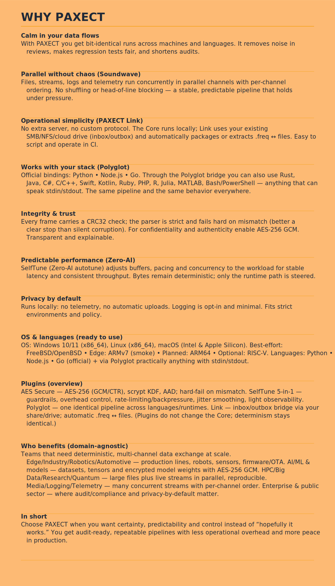
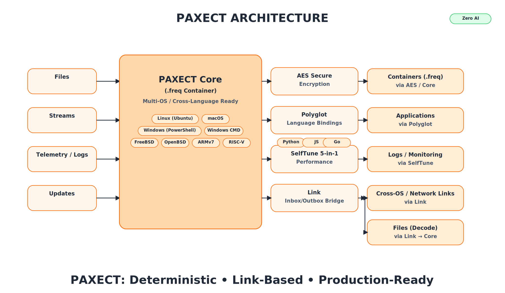
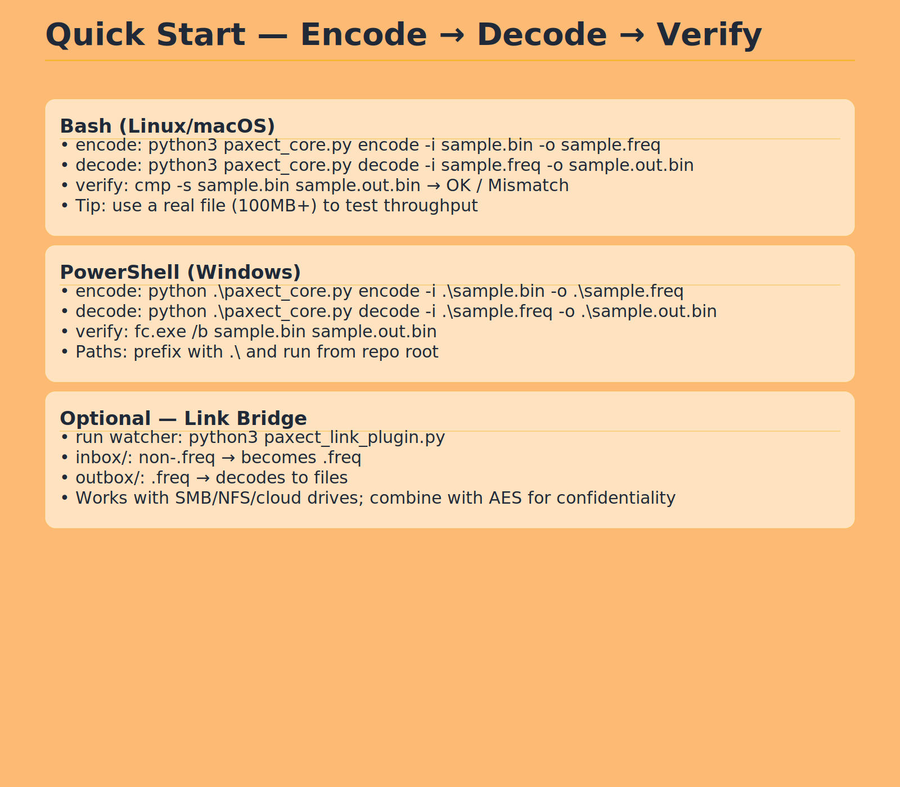
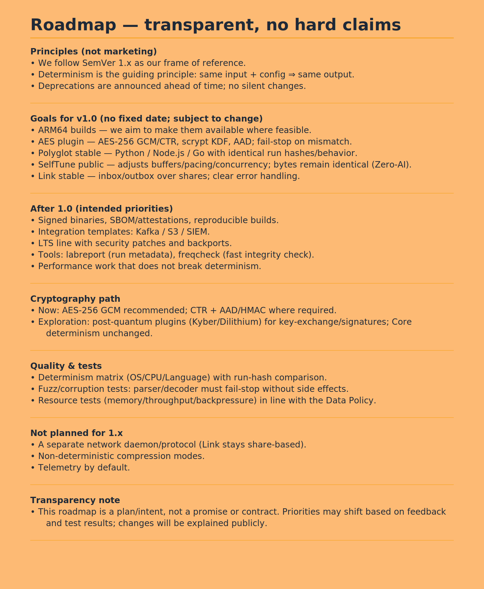
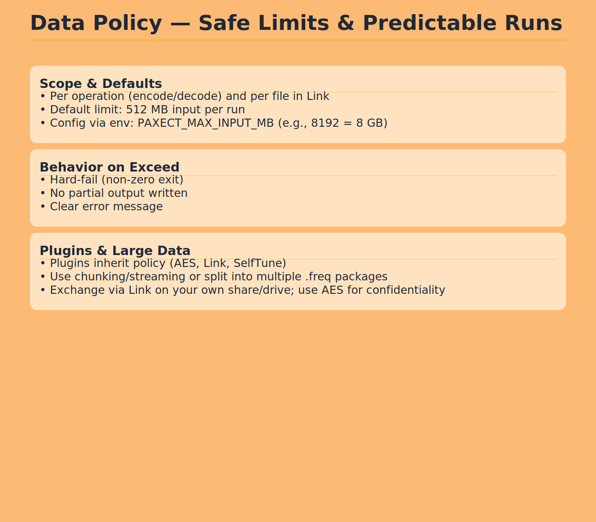
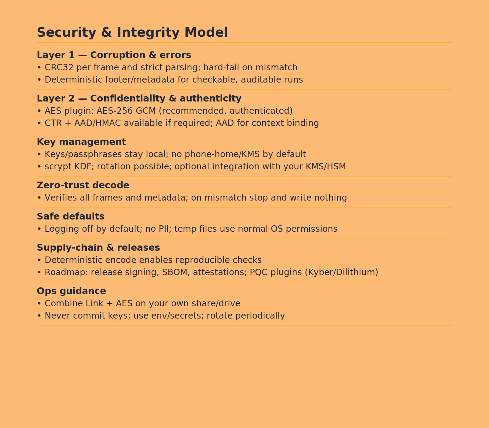

  

## PAXECT Core

**Deterministic data container for modern systems:**
PAXECT Core is a cross-platform, reproducible **`.freq` v42** container with **CRC32 per frame + SHA-256 footer** integrity,plug-and-play with zero dependencies and no vendor lock-in. **streaming Zstandard**, **multi-channel (1–8)** I/O, and full **stdin/stdout** support. Built for **offline**, auditable pipelines and **byte-identical** outcomes across OSes. 

It pairs cleanly with the wider PAXECT-Core Complete  ecosystem: **AEAD Hybrid** (optional encryption), **Link** (inbox/outbox relay), **Polyglot** (language bridges), and **SelfTune** (runtime guardrails). **Zero telemetry.**

*No AI heuristics, just stable, predictable, and verifiable data handling.*

## Supported Platforms & Languages

**Operating systems:** Linux (Ubuntu, Debian, Fedora), macOS 13+, Windows 10/11, Android (Termux), iOS (Pyto), FreeBSD/OpenBSD (experimental).
**Languages:** Official: Python. Via CLI/Polyglot: Node.js, Go. Also tested: Rust, Java, C/C++, C#, Swift, Kotlin, PHP, Ruby, R, Julia, MATLAB, Bash, PowerShell.

**Operating Systems:**  
- Windows 10/11 (x86_64)  
- Linux (x86_64)  
- macOS (Intel & Apple Silicon)  
- Best-effort: FreeBSD, OpenBSD  
- Edge devices: ARMv7 (experimental), ARM64 (planned), RISC-V (optional)  

**Languages (via Polyglot Bridge):**  
- Official: Python, Node.js, Go  
- Also tested: Rust, Java, C#, C/C++, Swift, Kotlin, Ruby, PHP, R, Julia, MATLAB, Bash/PowerShell  
- Any language that can spawn a process and read/write stdin/stdout
- 
- [Demo Suite](demos/README.md) — 10 deterministic cross-OS examples  
- [Test Framework](README_TESTS.md) — validation, coverage, and CI integration  
- [Security & Compliance](SECURITY.md) — conduct, license, and data policy

.svg)
.svg)

## Plugins (official)

| Plugin                         | Scope                           | Highlights                                                                           | Repo                                                                                                                           |
| ------------------------------ | ------------------------------- | ------------------------------------------------------------------------------------ | ------------------------------------------------------------------------------------------------------------------------------ |
| **Core**                       | Deterministic container         | `.freq` v42 · multi-channel · CRC32+SHA-256 · cross-OS · offline · no-AI             | [https://github.com/PAXECT-Interface/paxect---core.git](https://github.com/PAXECT-Interface/paxect---core.git)                             |
| **AEAD Hybrid**                | Confidentiality & integrity     | Hybrid AES-GCM/ChaCha20-Poly1305 — fast, zero-dep, cross-OS                          | [https://github.com/PAXECT-Interface/paxect-aead-hybrid-plugin](https://github.com/PAXECT-Interface/paxect-aead-hybrid-plugin) |
| **Polyglot**                   | Language bindings               | Python · Node.js · Go — identical deterministic pipeline                             | [https://github.com/PAXECT-Interface/paxect-polyglot-plugin](https://github.com/PAXECT-Interface/paxect-polyglot-plugin)       |
| **SelfTune 5-in-1**            | Runtime control & observability | No-AI guardrails, overhead caps, backpressure, jitter smoothing, lightweight metrics | [https://github.com/PAXECT-Interface/paxect-selftune-plugin](https://github.com/PAXECT-Interface/paxect-selftune-plugin)       |
| **Link (Inbox/Outbox Bridge)** | Cross-OS file exchange          | Shared-folder relay: auto-encode non-`.freq` → `.freq`, auto-decode `.freq` → files  | [https://github.com/PAXECT-Interface/paxect-link-plugin](https://github.com/PAXECT-Interface/paxect-link-plugin)    

**Plug-and-play:** Core runs without plugins. Enable per run via config/flag or through the binding API. Deterministic behavior remains identical.

 Have a bug or feature request? Please open an **Issue**.  
 General questions or ideas? Use **Discussions › Q&A**. We convert strong ideas to Issues so they can ship.

⭐ If PAXECT helped you, please consider a star — it helps others discover the project and supports the maintainers.

  

# 13) Path to Paid

**PAXECT** is built to stay free and open-source at its core.  
At the same time, we recognize the need for a sustainable model to fund long-term maintenance and enterprise adoption.

### Principles

- **Core stays free forever** — no lock-in, no hidden fees.  
- **Volunteers and researchers**: always free access to source, builds, and discussions.  
- **Transparency**: clear dates, no surprises.  
- **Fairness**: individuals stay free; organizations that rely on enterprise features contribute financially.

### Timeline

- **Launch phase:** starting from the official **PAXECT product release date**, all modules — including enterprise — will be free for **6 months**.  
- This free enterprise period applies **globally**, not per individual user or download.  
- **30 days before renewal:** a decision will be made whether the free enterprise phase is extended for another 6 months.  
- **Core/baseline model:** always free with updates. The exact definition of this baseline model is still under discussion.

### Why This Matters

- **Motivation:** volunteers know their work has impact and will remain accessible.  
- **Stability:** enterprises get predictable guarantees and funded maintenance.  
- **Sustainability:** ensures continuous evolution without compromising openness.

  

.svg)
## SEO & Discoverability

**What we are (short):**  
Deterministic cross-OS data container (.freq v42) with CRC32-per-frame integrity, optional  AEAD Hybrid/AES-256/AES-GCM, SelfTune (No-AI) for latency stability, Polyglot bindings, and a simple Link bridge.  
Local-only. No telemetry.

 Quick navigation: [WHY PAXECT](#1-why-paxect) · [Quick Start](#2-quick-start) · [Plugins](#plugins-official)

**Badges (suggested):** License · CI · CodeQL · Discussions  

**Accessibility & clarity:**  
- High-contrast text, concise headings, descriptive alt text  
- No tracking pixels, no external scripts  

**Tone & claims:**  
- Plain, verifiable wording  
- Roadmap = intent (no hard dates)  
- Privacy-by-default and determinism stated factually  

**Where we fit (no buzzwords):**  
- Reproducible packaging & exchange across OS/languages  
- Integrity with optional confidentiality  
- Parallel multi-channel flows  
- No telemetry  
- No-AI autotuning for latency stability  
- Path to Paid  

---

## Sponsorships & Enterprise Support

PAXECT SelfTune is maintained as a verified plug-and-play enterprise module.  
Sponsorships enable continuous validation, reproducibility testing, and deterministic compliance across Linux, Windows, and macOS platforms.

 **Enterprise Sponsorship Options**
- Infrastructure validation and cross-platform QA  
- CI/CD and performance compliance testing  
- Integration and OEM partnerships  

 **How to get involved**
- [Become a GitHub Sponsor](https://github.com/sponsors/PAXECT-Interface)  
- For enterprise or OEM inquiries: **enterprise@PAXECT-Team@outlook.com**

---
## Governance & Ownership
- **Ownership:** All PAXECT products and trademarks (PAXECT™ name + logo) remain the property of the Owner.
- **License:** Source code is Apache-2.0; trademark rights are **not** granted by the code license.
- **Core decisions:** Architectural decisions and **final merges** for Core and brand-sensitive repos require **Owner approval**.
- **Contributions:** PRs are welcome and reviewed by maintainers; merges follow CODEOWNERS + branch protection.
- **Naming/branding:** Do not use the PAXECT name/logo for derived projects without written permission; see `TRADEMARKS.md`.
---
### Contact

📧 contact@PAXECT-Team@outlook.com  

🐞 [Issues](https://github.com/PAXECT-Interface/PAXECT---Core/issues)  
💬 [Discussions](https://github.com/PAXECT-Interface/PAXECT---Core/discussions)  

*For security-related issues, please use responsible disclosure channels.*

---
Copyright © 2025 PAXECT 

---

  

---

  

---

  

---

  

---

  

---

  

---

  

---
## Keywords & Topics

**PAXECT Core** — deterministic multi-channel **.freq v42** container with **CRC32** integrity, **AEAD Hybrid/AES-GCM/CTR** security, cross-OS **Polyglot** bridges, and **No-AI SelfTune**.

These keywords improve discoverability on GitHub and search engines:

- **Core/Format:** paxect, freq42, deterministic, reproducible, data-container, wire-format
- **Integrity & Security:** crc32, checksum, encryption, aes-256, aes-gcm, aes-ctr, AEAD Hybrid
- **Performance/Runtime:** selftune, zero-ai, autotune, zstandard, compression, streaming
- **Interoperability:** cross-os, cross-language, polyglot, language-bindings, os-bridge
- **Exchange/Pipelines:** file-watcher, inbox-outbox, link-bridge
- **Compliance/Deployment:** audit-compliance, privacy-by-default, edge-computing, iot, system-integration

## Why PAXECT (recap)

- Bit-identical runs across OS/languages (audit, compliance, regression)
- Soundwave multi-channel: parallel lanes with per-channel ordering (no reordering)
- Operationally simple: Core runs locally; Link uses SMB/NFS/cloud (inbox/outbox)
- Risk-free extensibility: plugins (AEAD Hybrid, SelfTune, Polyglot, Link) without Core changes
- Privacy by default: local execution, no telemetry, No-AI

## Use Cases (examples)

- Quantum/Research: package circuits/results/logs reproducibly; share via Link + AEAD Hybrid
- AI/ML: tensors/datasets/models as `.freq`; deterministic; optional encryption
- Edge/Robotics/Automotive: stable multi-stream logging + firmware artifacts, cross-OS
- HPC/Big Data: large files + live streams in parallel; integrity guaranteed
- Media/Telemetry: many concurrent channels without head-of-line blocking

## Plugins (overview)

- **AEAD Hybrid:** AEAD Hybrid  AES-256 GCM/CTR, scrypt KDF, AAD; fail-stop on mismatch
- **Polyglot:** Python/Node.js/Go; same deterministic pipeline across runtimes
- **SelfTune 5-in-1:** guardrails, overhead control, rate-limiting/backpressure, smoothing, light observability
- **Link (Inbox/Outbox):** shared-folder bridge; auto-encode non-`.freq` → `.freq`, auto-decode `.freq` → files; zero server

## Quick Start

- Encode → Decode → Verify in two commands (Bash/PowerShell)
- Output is bit-identical to input (`cmp` or `fc /b`)
- Optional: run Link watcher and drop files into `inbox/` for auto package/extract

## Data Policy

- Default limit: **512 MB per operation** (predictable performance; DoS-resistant)
- Configurable: `PAXECT_MAX_INPUT_MB` (e.g., 8192 for 8 GB)
- On exceed → **hard-fail**, no partial output; Link inherits same policy

## Security & Privacy

- Integrity: CRC32 per frame; strict parser; **fail-stop** on mismatch
- Confidentiality/Authenticity: ** AEAD Hybrid/AES-256 GCM** (recommended) or **CTR + AAD/HMAC**
- Privacy: local-only; **no telemetry**; logging is opt-in and minimal

## Support & Compatibility

- **OS:** Windows 10/11, Linux, macOS
- **Shells:** CMD/PowerShell/Bash; CI-friendly
- **Languages:** Python • Node.js • Go (more via Polyglot/stdin-stdout)
- **CPU:** x86_64 (tested), ARMv7 (smoke), ARM64 (planned), RISC-V (optional)

## Roadmap (transparent)

- **Principles:** SemVer 1.x; determinism first; no silent changes
- **Aims for 1.0:** ARM64 builds (where feasible), AEAD Hybrid plugin GA, Polyglot stable, SelfTune public, Link stable
- **Post-1.0 (intent):** signed binaries, SBOM/attestations, templates (Kafka/S3/SIEM), LTS; PQC plugins exploration  
- *Note:* plan/intent, not a promise; priorities may shift with feedback/tests

## License, Community & Contact

- **License:** Apache-2.0 (`LICENSE`, `NOTICE`, `DISCLAIMER.md`)
- **Trademarks:** “PAXECT” + logo (`TRADEMARKS.md`)
- **Contributing:** `CONTRIBUTING.md`, `CODE_OF_CONDUCT.md`
- **Security:** responsible disclosure (`SECURITY.md`)
- **Community:** Discussions & Issues; transparent changelogs/roadmap

---

### ✅ Launch Summary — October 2025
**Status:** Production-Hardened · Multi-OS Verified · Ready for Audit  
All 10 demos verified on Linux, macOS, and Windows.  
Core deterministic behavior confirmed (CRC32 + SHA-256).  
Plugins (AEAD Hybrid, Polyglot, SelfTune, Link) verified compatible with PAXECT Core v42.  
Zero-AI verified: all tuning purely deterministic, no heuristics or telemetry.

---

## Keywords

paxect, freq42, deterministic, reproducible, data-container, wire-format, crc32, checksum, encryption, aes-256, aes-gcm, aes-ctr,AEAD, selftune, zero-ai, autotune, zstandard, compression, streaming, cross-os, cross-language, polyglot, language-bindings, os-bridge, file-watcher, inbox-outbox, link-bridge, audit-compliance, privacy-by-default, edge-computing, iot, system-integration, quantum, hpc, big data, media, telemetry, secure file transfer, open source, privacy-first, no telemetry

---

