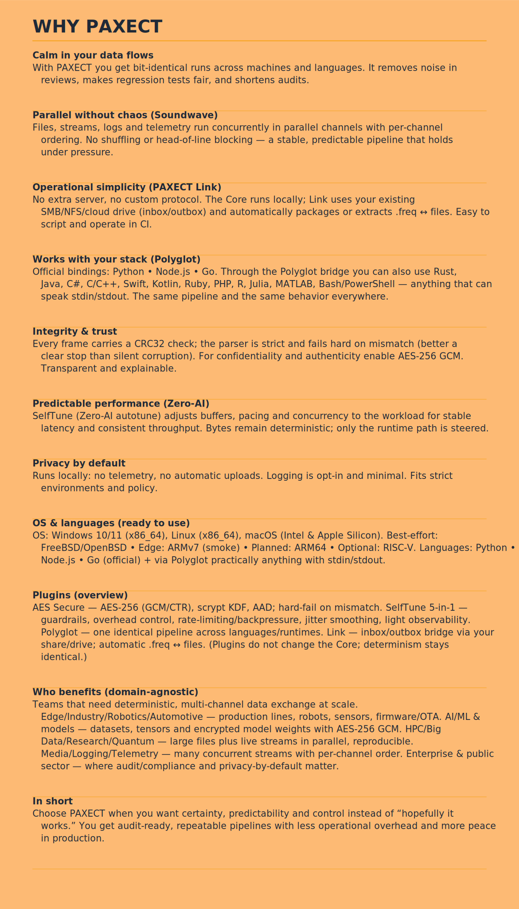
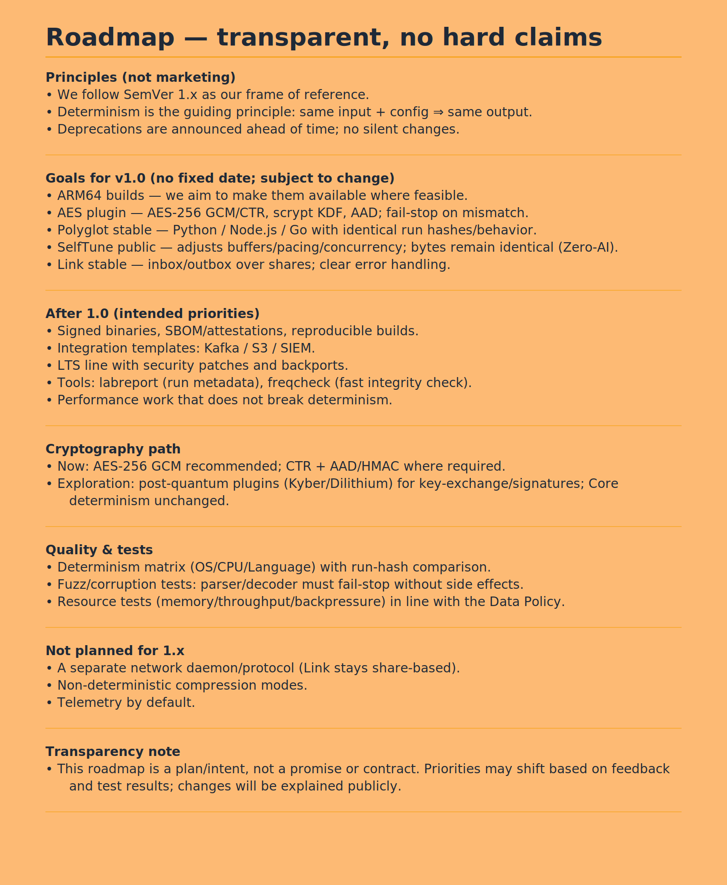
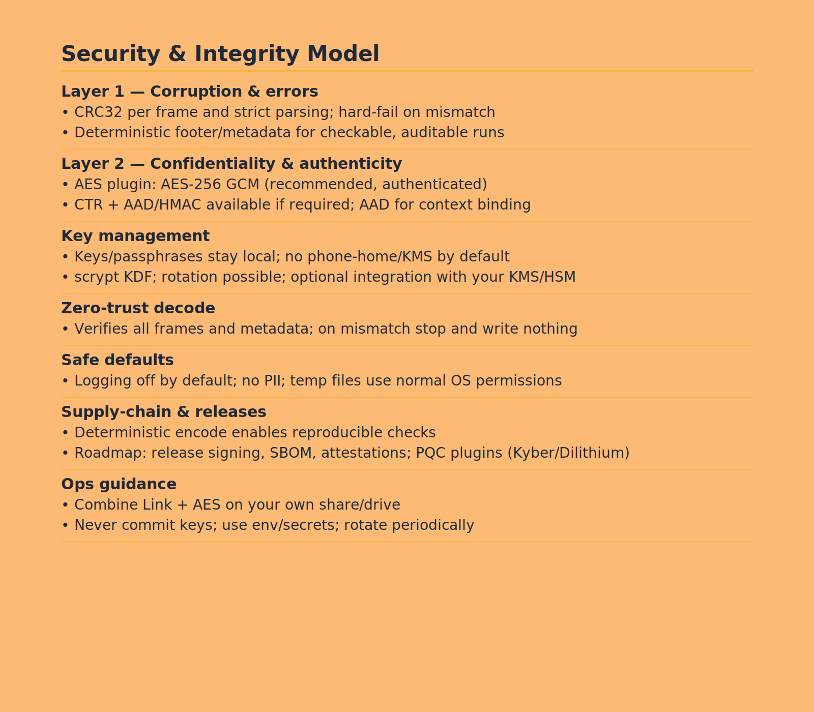

.svg)

---Use Cases

    Quantum computing: Transfer simulation results between quantum and classical nodes
    AI/ML pipelines: Rapid and secure exchange of tensors, arrays, and models
    Embedded & IoT: Efficient for low-memory devices and robotics
    Big Data / HPC: Fast checkpointing and large-scale data migration
    Hybrid Systems: Seamless communication across heterogeneous architectures

.svg)
.svg)
## Plugins (official)

| Plugin               | Scope                           | Highlights                                                                                   | Repo |
|----------------------|----------------------------------|----------------------------------------------------------------------------------------------|------|
| **AES Secure**       | Confidentiality & integrity      | AES-256 GCM/CTR, scrypt KDF, AAD; strict **fail-stop** on mismatch                           | https://github.com/PAXECT-Interface/paxect-aes-plugin |
| **Polyglot**         | Language bindings                | Python, Node.js, Go; identical deterministic pipeline across runtimes                        | https://github.com/PAXECT-Interface/paxect-polyglot-plugin |
| **SelfTune 5-in-1**  | Performance & observability      | Zero-AI autotune: guardrails, overhead control, rate-limiting/backpressure, jitter smoothing, lightweight observability | https://github.com/PAXECT-Interface/paxect-selftune-5in1 |
| **Link (Inbox/Outbox Bridge)** | Cross-OS file exchange        | Shared-folder bridge; auto-encode non-`.freq` → `.freq`, auto-decode `.freq` → files; zero server | https://github.com/PAXECT-Interface/paxect-link-plugin |

**Plug-and-play:** Core runs without plugins. Enable per run via config/flag or through the binding API. Deterministic behavior remains identical.

# 13) Path to Paid

PAXECT is built to stay **free and open-source at its core**.  
At the same time, we recognize the need for a sustainable model to fund long-term maintenance and enterprise adoption.

## Principles
- **Core stays free forever** — no lock-in, no hidden fees.  
- **Volunteers and researchers**: always free access to source, builds, and discussions.  
- **Transparency**: clear dates, no surprises.  
- **Fairness**: individuals stay free; organizations that rely on enterprise features contribute financially.  

## Timeline
- **Initial phase**: all modules, including enterprise, are free for the first **6 months**.  
- **30 days before renewal**: a decision will be made whether the free enterprise phase is extended for another 6 months.  
- **Core/baseline model**: always free with updates. The exact definition of this baseline model is still under discussion.  
 

## Why this matters
- **Motivation**: volunteers know their work has impact and will remain accessible.  
- **Stability**: enterprises get predictable guarantees and funded maintenance.  
- **Sustainability**: ensures continuous evolution without compromising openness.  

.svg)
## SEO & Discoverability

**What we are (short):**  
Deterministic cross-OS data container (.freq v42) with CRC32-per-frame integrity, optional AES-256/AES-GCM, SelfTune (Zero-AI) for latency stability, Polyglot bindings, and a simple Link bridge.  
Local-only. No telemetry.

**Quick navigation:** WHY PAXECT · Quick Start · Plugins  

**Badges (suggested):** License · CI · CodeQL · Discussions  

**Accessibility & clarity:**  
- High-contrast text, concise headings, descriptive alt text  
- No tracking pixels, no external scripts  

**Tone & claims:**  
- Plain, verifiable wording  
- Roadmap = intent (no hard dates)  
- Privacy-by-default and determinism stated factually  

**Where we fit (no buzzwords):**  
- Reproducible packaging & exchange across OS/languages  
- Integrity with optional confidentiality  
- Parallel multi-channel flows  
- Zero telemetry  
- Zero-AI autotuning for latency stability  
- Path to Paid

---

### Keywords & Topics

**PAXECT Core** — deterministic multi-channel **.freq v42** container with **CRC32 integrity**, **AES-GCM/CTR security**, **cross-OS polyglot bridges**, and **Zero-AI SelfTune**.

**Keywords:**  
paxect, freq42, deterministic, reproducible, data-container, wire-format, crc32, checksum, encryption, aes-256, aes-gcm, aes-ctr, selftune, autotune, zero-ai, zstandard, compression, streaming, cross-os, cross-language, polyglot, language-bindings, os-bridge, file-watcher, inbox-outbox, link-bridge, audit-compliance, privacy-by-default, edge-computing, iot, system-integration

---

---

## Contact
**contact@paxect.io** · Issues: https://github.com/PAXECT-Interface/PAXECT---Core/issues · Discussions: https://github.com/PAXECT-Interface/PAXECT---Core/discussions

